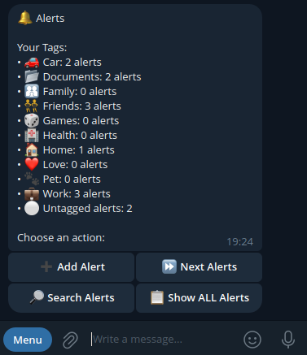
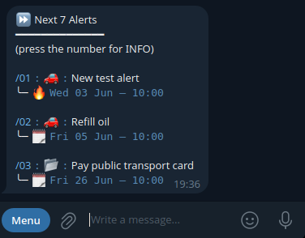
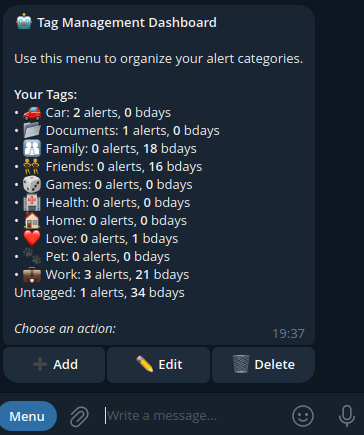
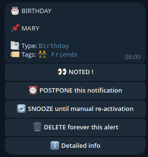
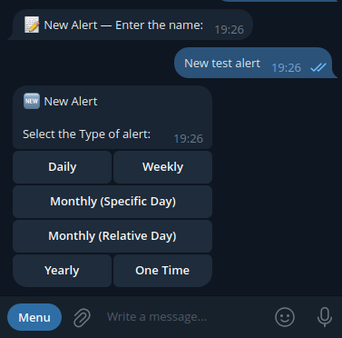
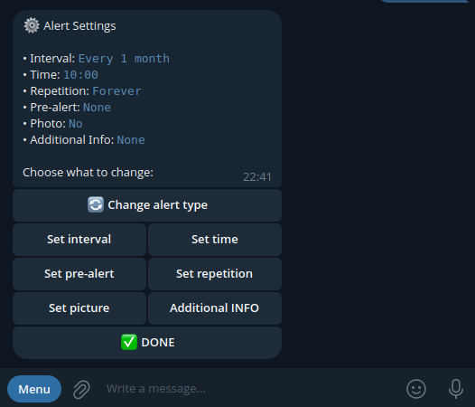
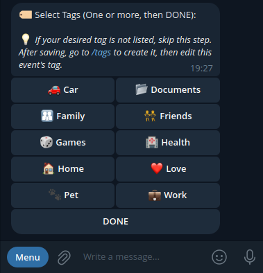
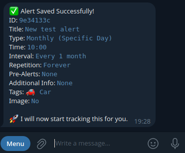

<div align="center">

# 🔔 MEMENTO

**A self-hosted Telegram bot for scheduling recurring and one-time reminders**

[](https://www.python.org/)
[](https://python-telegram-bot.org/)
[](https://www.kernel.org/)
[](https://apscheduler.readthedocs.io/)

[Features](#features) · [Quick Start](#quick-start) · [Configuration](#configuration) · [Usage](#usage) · [Developing the bot](#developing-the-bot)

</div>

---

**Memento** is a self-hosted Telegram notification engine. Create alerts that fire on any schedule — daily, weekly, monthly, yearly, or just once — and get notified directly in Telegram with optional pre-alerts, attached photos, and custom tags.

## Features

**7 Alert Types**

| # | Type | Schedule |
|---|---|---|
| 1 | **Daily** | Every N days |
| 2 | **Weekly** | Specific weekday(s), every N weeks |
| 3 | **Monthly (day)** | Specific calendar day(s), every N months |
| 4 | **Monthly (relative)** | Relative weekday (e.g. "last Monday"), every N months |
| 5 | **Yearly** | Specific DD/MM date(s), every year |
| 6 | **Once** | One-time alert on a single date |
| 7 | **Birthday** | Yearly, dedicated bot sections |

**Most alerts support:**

- **Tags** — organise alerts into custom emoji categories (e.g. `🏠 Home`, `💼 Work`)
- **Pre-alerts** — get notified 1 day, 1 week, 1 month, or a custom interval before the event
- **Custom time** — set any fire time, not just the default
- **Media** — attach a photo to any non-birthday alert
- **Repetition control** — repeat forever, until a date, or for N occurrences (types 1–4, 7)

**Platform features**

- **Timezone-aware** — per-user timezone, fully configurable
- **Backup system** — rolling local backups, export/import tools, and scheduled email delivery
- **Multi-user whitelist** — invite-based access control with an admin panel
- **Resilient delivery** — automatic Telegram API retry with degraded-mode tracking
- **Crash-safe storage** — atomic JSON writes, no data corruption on power loss
- **Search** — fuzzy search across alerts and birthdays


<table>
<tr>
<td align="center"><b>Alerts home</b></td>
<td align="center"><b>Upcoming alerts</b></td>
</tr>
<tr>
<td></td>
<td></td>
</tr>
<tr>
<td align="center"><b>Tag dashboard</b></td>
<td align="center"><b>Birthday notification</b></td>
</tr>
<tr>
<td></td>
<td></td>
</tr>
</table>

---

## Quick Start

### 1. Clone the repository

```bash
gh auth login

mkdir /PATH_TO_BOT_FOLDER/memento_bot
cd /PATH_TO_BOT_FOLDER/memento_bot
git clone git@github.com:TheGame93/memento_bot.git .
```

### 2. Install Python 3.12+

```bash
sudo apt update && sudo apt install -y python3 python3-pip python3.12-venv
python3 --version
```

### 3. Configure the environment

`./venv` will be automatically created and activated on the first run — no manual `pip install` needed.

```bash
cp .env.example .env
# then open .env and fill in your values
```

See [Configuration](#configuration) for all keys and how to get them.

If you want details about local data storage, backups, and logging expectations, see [PRIVACY.md](PRIVACY.md).

### 4. Start the bot

```bash
./startbot.sh
```

---

## Configuration

All configuration lives in `.env` in the project root. Use `.env.example` as your starting template.

```env
# ── Required ──────────────────────────────────────────────────────────────────
TELEGRAM_BOT_TOKEN=your_bot_token_here       # from @BotFather
TELEGRAM_USER_ID=your_telegram_user_id       # your numeric Telegram user ID

# ── Storage (optional) ────────────────────────────────────────────────────────
BOT_DATA_DIR=./data          # optional override, default is ./data
BOT_BACKUP_DIR=./backups     # optional override, default is ./backups

# ── Email backup (optional) ───────────────────────────────────────────────────
BOT_SMTP_HOST=smtp.gmail.com
BOT_SMTP_PORT=587
BOT_SMTP_USER=your_email@gmail.com
BOT_SMTP_PASS=your_app_password
BOT_SMTP_FROM=your_email@gmail.com
BOT_SMTP_TLS=1
BOT_SMTP_SSL=0
```

**How to get each value:**

| Key | How to get it |
|---|---|
| `TELEGRAM_BOT_TOKEN` | Create a bot with [@BotFather](https://t.me/BotFather) and copy the token |
| `TELEGRAM_USER_ID` | Send any message to [@userinfobot](https://t.me/userinfobot) — it replies with your numeric ID |
| `BOT_SMTP_PASS` | For Gmail: [generate an App Password](https://support.google.com/accounts/answer/185833); your main password will not work |

---

## Usage

### Starting the bot

```bash
./startbot.sh
```

The launcher handles virtual-environment setup, single-instance locking, and automatic respawn on crash.

#### Startup flags

| Flag | Short | Effect |
|---|---|---|
| `--help` | `-h` | Show usage and exit |
| `--clean` | `-c` | Remove test artifacts before launch |
| `--new` | `-n` | Remove all log files before launch |
| `--force-start` | | Continue startup even if cleanup fails |

Flags can be combined: `./startbot.sh -nc` runs both cleanups, then starts.

---

### Bot commands

| Command | Description |
|---|---|
| `/start` | Welcome message and onboarding |
| `/help` | Documentation and command guide |
| `/alerts` | List and manage all your alerts |
| `/birthdays` | List and manage birthdays |
| `/tags` | Manage alert categories |
| `/cancel` | Stop the current operation |
| `/settings` | User preferences, birthdays, and backups |
| `/status` | Bot status, uptime, and runtime info |
| `/manage` | Admin/developer dashboard (privileged users only) |

---

### Creating an alert

Open `/alerts`, then tap **Add Alert** and follow the step-by-step wizard:

<table>
<tr>
<td align="center"><b>1. Name &amp; type</b></td>
<td align="center"><b>2. Settings</b></td>
</tr>
<tr>
<td></td>
<td></td>
</tr>
<tr>
<td align="center"><b>3. Tags</b></td>
<td align="center"><b>4. Saved</b></td>
</tr>
<tr>
<td></td>
<td></td>
</tr>
</table>

**Wizard steps:**
1. Enter a title
2. Pick the alert type (Daily, Weekly, Monthly, Yearly, Once)
3. Set the schedule details (days, weekday, interval)
4. Configure settings: fire time, pre-alert, repetition, optional photo
5. Select one or more tags (or skip)
6. Review the summary — **Save** or **Discard**

Birthdays use their own dedicated flow under `/birthdays`.

---

### Managing upcoming alerts

From `/alerts`, tap **Next Alerts** to see your next 7 upcoming events sorted by date across all alert types:

<p align="center">
  
</p>

---

### Birthdays

Use `/birthdays` to add, browse, search, and tag birthdays. Birthday notification time is customizable in `/settings`, and birthday notifications can offer an optional generated birthday-message action:

<p align="center">
  
</p>

Birthday alerts support **Postpone**, **Snooze**, and **Detailed info** — same as regular alerts.

---

### Tags

Tags are emoji + name pairs (`🏠 Home`, `💼 Work`, `🐾 Pet`, …). Use `/tags` to add, rename, and delete categories, and see how many alerts each tag is used on:

<p align="center">
  
</p>

A default set of tags is created for every new user. All tags are stored per-user and fully customisable.

---

### Backups

The bot keeps rolling local backups of your data automatically. Open `/settings` → **Backups** to export a backup, import a backup ZIP, or configure backup-via-email. If email backup is enabled, backups are also delivered on a monthly schedule.

- `/settings` → **Backups** — export/import your backup and manage mail backup
- `/manage` → **Backups** — server-side restore and elevated backup tools for admin/developer users

---

## Developing the bot

### Testing

Run the full test suite (recommended before deploying changes):

```bash
./venv/bin/python3 tests/master_debugger.py --offline
```

| Option | Effect |
|---|---|
| `--offline` | Treat startup network-bootstrap noise as informational when startup hooks succeed (recommended for local runs) |
| `--allow-warn` | Downgrade operational warnings to non-fatal |

### Maintenance helpers

```bash
# Remove test artifacts: tests/log/ and test backup ZIPs
./ops/remove_tests_artifacts.sh

# Remove all repo log files (*.log) outside .git and venv
./ops/remove_all_logfiles.sh
```

### Dependencies

| Package | Purpose |
|---|---|
| `python-telegram-bot` | Telegram Bot API client (v22, async) |
| `APScheduler` | Tick-based alert scheduling |
| `python-dotenv` | `.env` configuration loading |
| `psutil` | Process management and single-instance lock |
| `pytz` + `python-dateutil` | Timezone handling and date arithmetic |
| `rapidfuzz` | Fuzzy search for alerts and birthdays |
| `timezonefinder` | Timezone lookup from coordinates |

Dependencies are installed automatically on first run.

### Further reading

- [PRIVACY.md](PRIVACY.md) — public-facing notes about local data, backups, and logging
- [EMAIL_BACKUP_SETUP.md](EMAIL_BACKUP_SETUP.md) — Gmail and SMTP setup for backup-via-email
- [PROJECT_RULES.md](PROJECT_RULES.md) — project constraints, invariants, and development workflow
